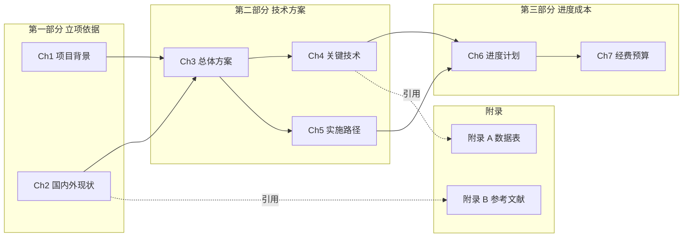
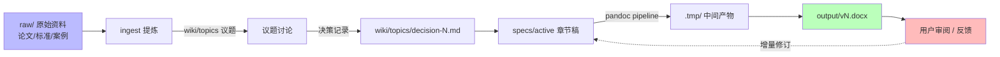

# {{PROJECT_NAME}} 🔒 — {{PROJECT_DESCRIPTION}}

> 一句话给访客看的文档项目定位（≤ 80 字）。**🔒 默认私人**：不推送公开 GitHub/Gitee。

<!--
占位符清单（派生后 scaffold 时替换）：
- {{PROJECT_NAME}}         项目全名，如 UWAprojDoc
- {{PROJECT_SLUG}}         小写短名，如 uwaprojdoc
- {{PROJECT_DESCRIPTION}}  一句话描述
- {{MAIN_DELIVERABLE}}     主交付物，如《XX 水声专项方案》
- {{PROJECT_PATH}}         本地路径，如 D:\Claude\DocProcess\<名>
- {{REMOTE_URL}}           远端仓库（仅内网 GitLab，禁公开）
验证：! grep -qE "\{\{[A-Z_]+\}\}" README.md && echo "placeholders: OK"
-->

---

## 项目规模

| 指标 | 数值 | 说明 |
|------|------|------|
| 主交付物 | {{MAIN_DELIVERABLE}} | docx / pdf / md |
| 当前版本 | vN（YYYY-MM-DD）| 文件大小 N MB |
| 章节数 | N 章 | 含附录 N 个 |
| 图表数 | N 张 | 含 Visio / Mermaid / PPT 嵌入 |
| Git 提交数 | N 次 | main 分支 |
| raw/ 资料 | N 篇 | 论文 / 标准 / 案例 |

---

## 文档结构

```
{{PROJECT_SLUG}}/
├── output/                 # 成品 docx / pdf 输出
├── specs/active/           # 章节子文档（撰写中）
├── specs/archive/          # 已交付章节
├── raw/                    # 只读参考资料
├── wiki/topics/            # 议题讨论 / 决策记录
└── .tmp/                   # pandoc / build pipeline 中间产物
```

---

## 章节依赖图

> 文档章节间的**逻辑依赖**（哪些章节为后续章节提供前置）。document 类项目无代码调用关系，对应替代为章节间的**信息依赖**。
>
> 渲染：GitHub / GitLab / Obsidian 直接显示 Mermaid。



**绘图约定**：
- `subgraph` 按文档部分（第一/第二/.../附录）分组
- 实线 `-->` = 内容依赖（后章节需前章节结论才能展开）
- 虚线 `-.引用.->` = 引用关系（如正文引用附录数据表 / 参考文献）

---

## 信息流图

> 原始资料 → 提炼 → 章节落地的**信息流向**。便于追溯每章内容来源 + 决策路径。



**绘图约定**：
- 蓝色节点 = 输入侧（raw / 用户输入）；绿色 = 最终成品；红色 = 反馈循环
- 实线 = 信息正向流；虚线 = 反馈/迭代流（修订 / 用户反提）

---

## 章节产出物清单

> 对应章节依赖图**每个章节**的具体产出物 + 来源资料 + 状态。文档项目的"接口表"。

| # | 章节 | 产出物（路径） | 来源资料（raw/）| 字数 / 页数 | 状态 |
|---|---|---|---|---|---|
| 1 | Ch1 项目背景 | `specs/archive/ch1-background.md` | `raw/policy-XXX.pdf` | 2000 字 / 3 页 | ✅ |
| 2 | Ch2 国内外现状 | `specs/archive/ch2-soa.md` | `raw/papers/*.pdf` (N 篇) | 4500 字 / 6 页 | ✅ |
| 3 | Ch3 总体方案 | `specs/active/ch3-overall.md` | wiki/topics/decision-001~003 | 6000 字 / 10 页 | 🟡 |
| 4 | Ch4 关键技术 | `specs/active/ch4-tech.md` | — | — / — | 🔴 |
| 5 | 附录 A 数据表 | `specs/archive/apx-a-data.md` | `raw/data/*.csv` | — / 8 表 | ✅ |

**表格约定**：
- 状态：✅ 已交付 / 🟡 撰写中 / 🔴 未启动
- "来源资料" 链接到 `raw/` 下具体文件；若有 wiki/topics 议题决策，链接对应 decision-N
- 字数 / 页数按最终成品估算

---

## 快速上手

### 启动撰写

```bash
# 1. 派生项目（首次）
cp -r D:\Claude\ohmybrain-core\template-document\  →  {{PROJECT_PATH}}

# 2. 摄入 raw/ 资料
# 把论文 / 标准 / 案例放 raw/，然后用 /ingest 提炼到 wiki/

# 3. 起草章节
# 在 specs/active/ 建章节稿（每章一个 .md），完成后归档到 specs/archive/

# 4. 编译成 docx
python scripts/build_docx.py  # 或项目实际 pipeline
```

### 议题讨论

不确定的技术决策放 `wiki/topics/F-N.md`（编号议题），用户决断后落 `wiki/topics/decision-N.md`，然后才进 `specs/`。

---

## 文档导航

| 文档 | 用途 |
|------|------|
| `CLAUDE.md` | Claude Code harness 配置 |
| `wiki/index.md` | 项目知识层入口 |
| `wiki/log.md` | 操作日志（章节增删 / 议题决策）|
| `wiki/topics/` | 议题讨论 / 决策记录 |
| `specs/active/` | 撰写中的章节稿 |
| `output/` | 成品 docx / pdf |

---

## 关联项目

- **依赖资料**：{{DEPENDS_ON}}
- **Hub**：`D:\Claude\Ohmybrain` — 跨项目知识中心（领域问题 query；文档方法论结论走 `<private>` 标签或私人区域）

---

## 参考

本 README 三张图章节的模板源自 **W1 阵列校准模块**（engineering 类首个完整范例，2026-05-25）：

- 路径：`D:/Claude/worktrees/UWAcomm_usbl-calibration/src/calibration/W1/README.md` § 6.1
- 适配：engineering 类的「调用关系 / 数据流 / 接口表」三章节，在 document 类语义中替换为「章节依赖 / 信息流 / 产出物清单」

---

## 注意事项

- 🔒 **默认私人**：不推送公开 GitHub/Gitee，仅内网 GitLab Internal 可见
- `raw/` 下第三方资料须确认版权后再纳入
- 跨项目方法论结论走 `<private>` 标签或私人区域，不直接 `/promote` 公开 wiki
