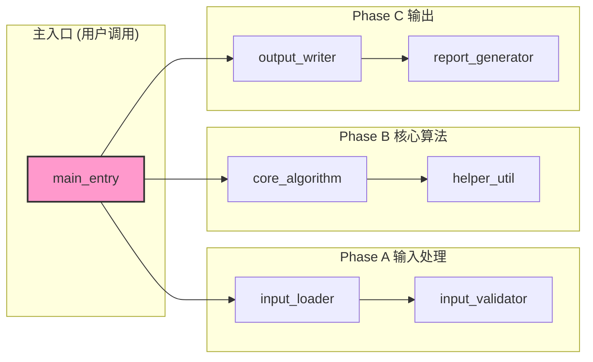
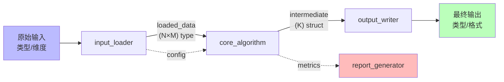

# {{PROJECT_NAME}} — {{PROJECT_DESCRIPTION}}

> 一句话给访客看的项目定位（≤ 80 字，避免长段落）。

<!--
占位符清单（派生后 scaffold 时替换）：
- {{PROJECT_NAME}}         项目全名，如 UWAcomm
- {{PROJECT_SLUG}}         小写短名，如 uwacomm
- {{PROJECT_DESCRIPTION}}  一句话描述
- {{DEPENDS_ON}}           依赖项目（可多，逗号分隔）
- {{PROJECT_PATH}}         本地路径，如 D:\Claude\TechReq\<名>
- {{REMOTE_URL}}           远端仓库地址（gitlab / github）
验证：! grep -qE "\{\{[A-Z_]+\}\}" README.md && echo "placeholders: OK"
-->

---

## 项目规模

| 指标 | 数值 | 说明 |
|------|------|------|
| 源码文件 | **N 个** | 含测试 / 可视化 / 辅助 |
| 代码总行数 | **N 行** | YYYY-MM-DD 统计 |
| 算法模块 | N 个 | XX-YY |
| Git 提交数 | **N 次** | main 分支 |
| 测试覆盖 | N 个测试文件 / N 项 | XX% 通过率 |

---

## 模块架构

```
{{PROJECT_SLUG}}/
├── 01_ModuleA/             # 模块 A 一句话职责
├── 02_ModuleB/             # 模块 B 一句话职责
├── ...
└── NN_TopLevel/            # 顶层端到端集成
```

> 模块命名约定 + 子目录结构按项目自定。建议每个模块自带 README（接口表 + 算法描述 + 测试覆盖 + 使用示例）。

---

## 调用关系图

> 模块/函数间的调用关系（**谁调用谁**）。按 Phase / Layer / Module 分组，调用方向用 `-->` 标注；数据传递用 `-.数据名.->` 虚线区分。
>
> 渲染：GitHub / GitLab / Obsidian 直接显示 Mermaid。



**绘图约定**：
- `subgraph` 按 Phase / Layer / Module 类别分组，名称含"(N)" 标函数数量便于规模感知
- 实线 `-->` = 直接调用（callee 在 caller 内被显式调用）
- 虚线 `-.label.->` = 数据/结果传递（被引用但不直接 call，如 struct 字段消费）
- 入口节点用 `classDef entry` 高亮
- ≤ 30 节点；超过时按 Phase 拆多张子图

---

## 数据流图

> 输入数据 → 中间数据 → 输出 struct/文件。每条边的 label = **数据名（含维度）**。便于理解每一步的输入输出契约。
>
> 与调用关系图互补：调用关系图回答"代码怎么走"，数据流图回答"数据怎么传"。



**绘图约定**：
- 节点用矩形 = 函数 / 用色块 = 终态（输入蓝 / 输出绿 / 副产物红）
- 边 label = `"数据名\n(维度) type"`（双引号 + `\n` 多行）
- 实线 = 数据主流；虚线 = 配置/副流（config / metadata / metrics）

---

## 数据流接口详细表

> 对应数据流图**每条边**的具体数据格式 + 物理含义 + 实测样例。debug 时直接对照查阅。
>
> 样例从默认 fixtures / minimal config 跑出的数值填写，便于他人复现。

| # | 数据流（边标签） | 变量名 | 维度 + 类型 | 物理含义（单位）| 样例（fixtures default config）|
|---|---|---|---|---|---|
| 1 | **原始输入** | `input_raw` | `(N × M) double` | … | `(100, 50)`, 量级 ~ 1e-3 |
| 2 | loaded_data | `data_loaded` | `(N × M) double` | input_loader 输出 | 复值，相位 ∈ [-π, π] |
| 3 | intermediate | `intermediate.field1` | `struct` | 中间结果 | `field1=…` `field2=…` |
| 4 | **最终输出** | `result` | `struct` K 字段 | 算法最终输出 | `pass=true`, `RMSE=0.02` |

**表格约定**：
- "维度 + 类型" 用 MATLAB / NumPy 风格表示（`(N × M) complex` / `cell{...}` / `struct`）
- 关键节点用 `**粗体**` 标输入/输出边界
- 单位必填（m / s / Hz / dB / —）
- 样例值取最小可复现 config，便于他人 reproduce

---

## 快速上手

### 安装

```bash
git clone {{REMOTE_URL}} {{PROJECT_PATH}}
cd {{PROJECT_PATH}}
# 装环境（按项目语言补：pip install -r requirements.txt / addpath / cargo build ...）
```

### 跑个 demo

```bash
# 最小可复现 demo（按项目实际命令补充）
# 例：python demo.py / matlab -batch "run('demo.m')" / ./bin/demo
```

预期产出：…

---

## 文档导航

| 文档 | 用途 |
|------|------|
| `CLAUDE.md` | Claude Code harness 配置 |
| `wiki/index.md` | 项目知识层入口 |
| `wiki/dashboard.md` | 项目仪表盘（状态/规模/TODO 速查）|
| `specs/active/` | 当前任务 spec |
| `plans/` | 实现计划 |
| `src/<模块>/README.md` | 模块级详细接口表 + 算法描述 + 测试覆盖 |

---

## 关联项目

- **依赖**：{{DEPENDS_ON}}
- **Hub**：`D:\Claude\Ohmybrain` — 跨项目知识中心（领域问题 query / 跨项目结论 `/promote`）

---

## 参考：调用关系图 + 数据流图 + 接口表 完整范例

本 README 三张图章节的模板源自 **W1 阵列校准模块**（首个完整范例，2026-05-25）：

- 路径：`D:/Claude/worktrees/UWAcomm_usbl-calibration/src/calibration/W1/README.md` § 6.1
- 含：14 函数调用关系（按 Phase A-E 分组）+ ADC → W1_result 数据流（16 条边）+ 接口表（变量/维度/含义/fixtures 实测样例）
- 适用粒度：**模块级 14 函数 + W2 4 函数**

项目根 README（本模板）建议粒度：**模块-模块级**（不深入到函数）；模块内 README 走 W1 § 6.1 那种**函数级**。

---

## License / 注意事项

按项目实际情况补：
- 公开仓（如 UWAcomm / USBL）：选 license（MIT / Apache 2.0）
- 私人仓（🔒 内部）：明确"禁止推送公开 GitHub/Gitee"
