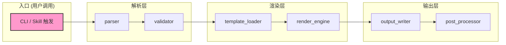
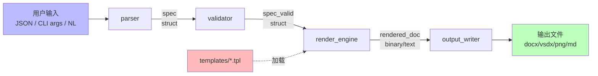

# {{PROJECT_NAME}} — {{PROJECT_DESCRIPTION}}

> 一句话给用户看的工具定位（≤ 80 字）。工具类项目主交付物 = 可复用 skill / template / CLI。

<!--
占位符清单（派生后 scaffold 时替换）：
- {{PROJECT_NAME}}         工具全名，如 FlowGen
- {{PROJECT_SLUG}}         小写短名，如 flowgen
- {{PROJECT_DESCRIPTION}}  一句话描述
- {{TRIGGER_KEYWORDS}}     skill 触发关键词（若是 Claude skill）
- {{PROJECT_PATH}}         本地路径，如 D:\Claude\Tools\<名>
- {{REMOTE_URL}}           远端仓库地址
验证：! grep -qE "\{\{[A-Z_]+\}\}" README.md && echo "placeholders: OK"
-->

---

## 工具规模

| 指标 | 数值 | 说明 |
|------|------|------|
| Skill / Command | N 个 | `~/.claude/skills/` 下 |
| Template 文件 | N 个 | templates/ 下 |
| CLI 命令 | N 个 | 入口脚本 |
| 触发关键词 | {{TRIGGER_KEYWORDS}} | 自动激活短语 |
| 输出格式 | docx / pdf / vsdx / png / md | |
| 依赖 | Python N+ / pywin32 / pandoc / ... | |

---

## 工具架构

```
{{PROJECT_SLUG}}/
├── templates/              # 渲染模板（python-pptx / pywin32 / pandoc）
├── scripts/                # CLI 入口 + helpers
├── wiki/                   # 设计文档 + 使用指南
├── raw/                    # 参考素材（样板 PPT / 论文等）
├── output/                 # 成品输出 / sample/
└── .claude/skills/         # 触发 skill 定义
```

---

## 调用关系图

> 命令入口 → helper 模块 → 渲染器的调用链。tool 类项目延用 engineering 的"调用关系"语义，节点单位 = 命令 / 模块。
>
> 渲染：GitHub / GitLab / Obsidian 直接显示 Mermaid。



**绘图约定**：
- `subgraph` 按 Layer（入口 / 解析 / 渲染 / 输出）分组
- 实线 `-->` = 直接调用
- 虚线 `-.label.->` = 配置 / 模板传递

---

## 数据流图

> 用户输入参数 → 模板渲染 → 输出文件的数据流。每条边 label = **数据名（含格式）**。



**绘图约定**：
- 蓝色 = 用户输入；绿色 = 最终输出；红色 = 配置/模板（侧流）
- 边 label = `"数据名\n格式"`

---

## 接口表（CLI / API / Skill 触发）

> 对应工具暴露给用户的**所有外部接口**。CLI 参数 / API 函数签名 / Skill 触发短语统一表格化。

### CLI 接口

| # | 命令 | 参数 | 默认 | 含义 | 输出 |
|---|---|---|---|---|---|
| 1 | `tool generate` | `--input <path>` | — | 输入文件路径 | output/result.xxx |
| 2 | | `--template <name>` | `default` | 模板选择 | — |
| 3 | | `--palette <key>` | `light` | 配色方案 | — |
| 4 | `tool validate` | `<file>` | — | 验证输出文件合法性 | exit 0/1 |

### API 接口（Python / Node）

| # | 函数 | 参数 | 返回 | 用途 |
|---|---|---|---|---|
| 1 | `render(spec, options)` | spec: dict / options: dict | path: str | 主渲染入口 |
| 2 | `validate(spec)` | spec: dict | list[error] | 输入校验 |

### Skill 触发短语（若是 Claude skill）

| # | 触发短语 | 行为 |
|---|---|---|
| 1 | "用 {{PROJECT_SLUG}} 生成 …" | 调用主渲染流程 |
| 2 | "{{PROJECT_SLUG}} validate" | 调用验证流程 |

**表格约定**：
- 三类接口分小节，按用户暴露面积排序（CLI 最常见 → API → Skill）
- 默认值用 `'default'` 反引号标
- 含义必填，避免读者猜参数语义

---

## 快速上手

### 安装

```bash
git clone {{REMOTE_URL}} {{PROJECT_PATH}}
cd {{PROJECT_PATH}}
pip install -r requirements.txt   # 或按项目实际补
```

### 跑个 demo

```bash
# 最小可复现 demo
python scripts/demo.py --input examples/sample.json
# 预期输出：output/sample.xxx
```

### 作为 Claude skill 使用

如果本工具是 Claude skill：

```bash
# 安装到全局 skill 池
cp -r .claude/skills/{{PROJECT_SLUG}} ~/.claude/skills/

# 触发：在任意会话用关键词 {{TRIGGER_KEYWORDS}}
```

---

## 文档导航

| 文档 | 用途 |
|------|------|
| `CLAUDE.md` | Claude Code harness 配置 |
| `wiki/index.md` | 工具设计文档入口 |
| `wiki/dashboard.md` | 工具状态 / TODO 速查 |
| `templates/README.md` | 模板编写指南 |
| `.claude/skills/{{PROJECT_SLUG}}/SKILL.md` | Skill 定义（触发关键词 + 协议）|

---

## 关联项目

- **依赖工具 / 库**：{{DEPENDS_ON}}
- **Hub**：`D:\Claude\Ohmybrain` — 跨项目知识中心（工具方法论可 `/promote` 沉淀为可复用模式）

---

## 参考

本 README 三张图章节的模板源自 **W1 阵列校准模块**（engineering 类首个完整范例，2026-05-25）：

- 路径：`D:/Claude/worktrees/UWAcomm_usbl-calibration/src/calibration/W1/README.md` § 6.1
- 适配：tool 类基本保持与 engineering 同结构，仅将函数节点替换为 CLI 命令 / API 函数 / Skill 触发短语，接口表三段化（CLI + API + Skill）

---

## License

按工具公开范围补：
- 公开工具：选 license（MIT 推荐）
- 内部工具（🔒）：明确"内网共享，禁止推送公开"
